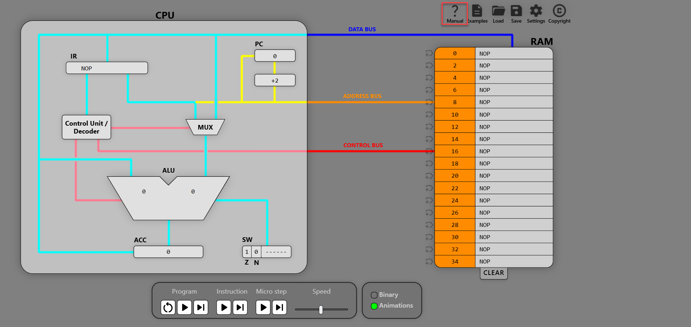
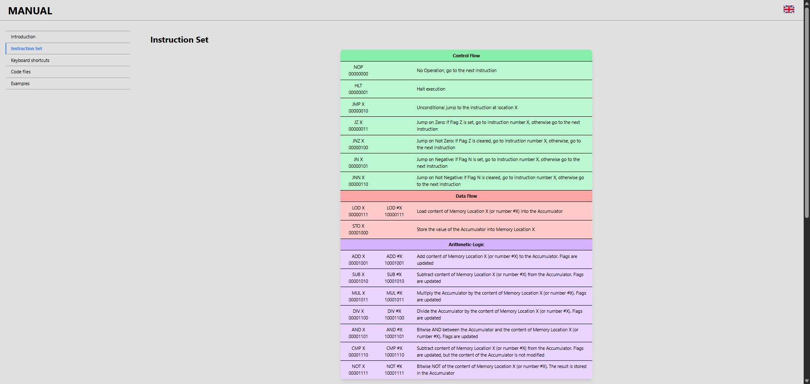
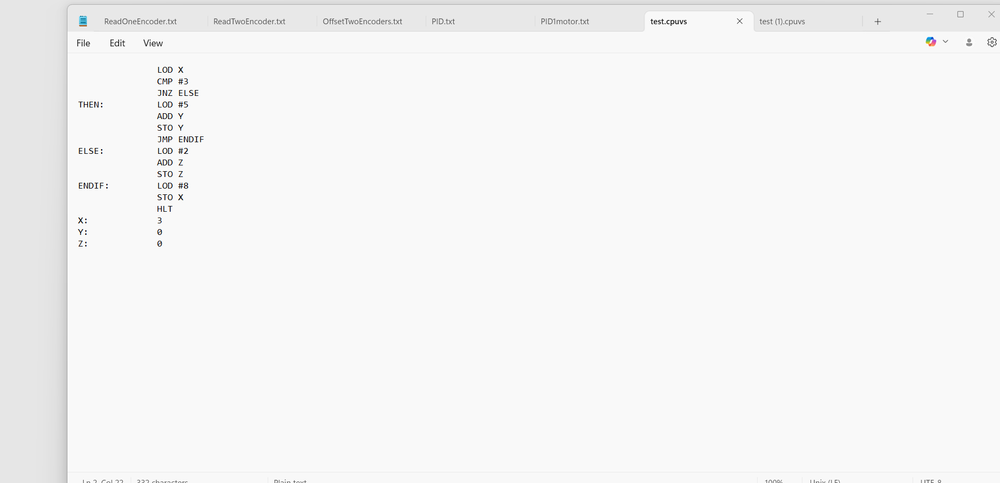
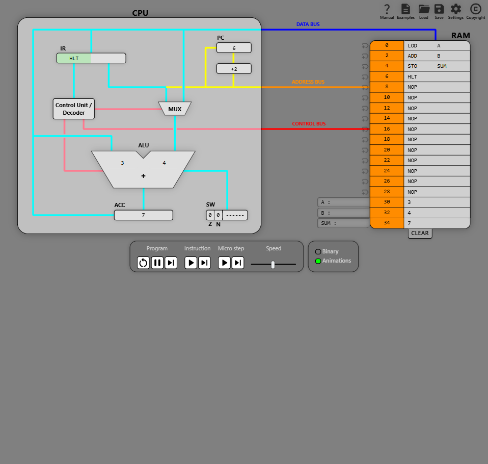
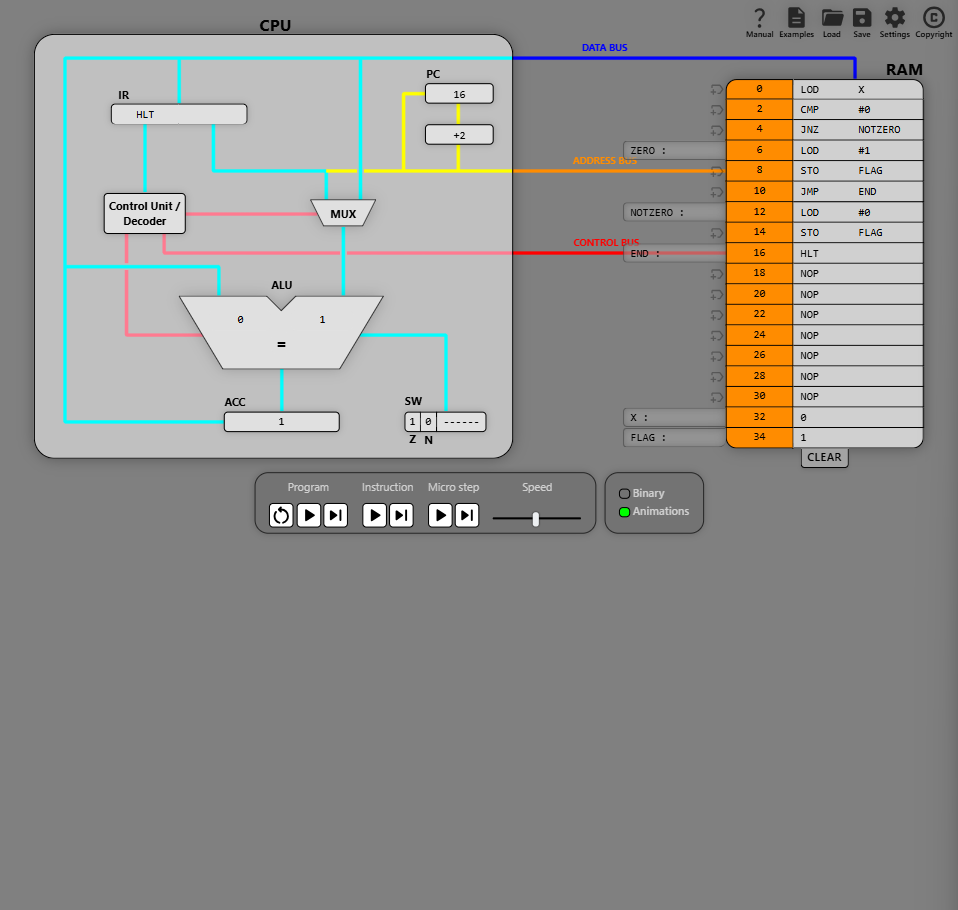
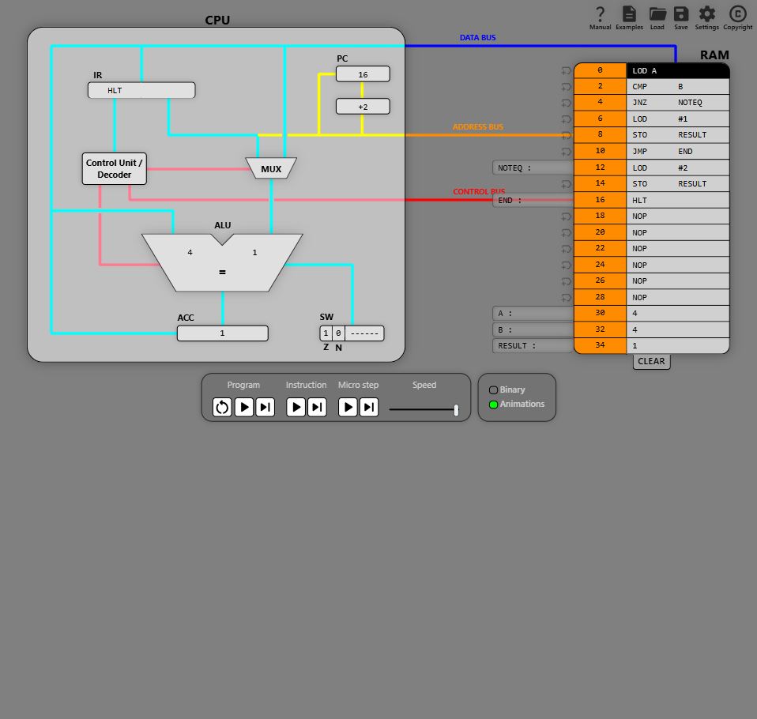

# Lab 3 — Beginner Assembly with the CPU Visual Simulator (ET4047)

**Module:** ET4047 · **Lab No.:** Lab 3 · **Author:** Luke Griffin
**University of Limerick — Department of Electronic & Computer Engineering**

📄 **View the full lab handout online:** https://lukegrif.github.io/W04-LAB-ET4047/

---

## Introduction

This lab introduces assembly programming using the
[CPU Visual Simulator](https://cpuvisualsimulator.github.io/). Over five tasks you
will see how a simple CPU uses **RAM addressing**, **instruction flow**,
**branching logic** and **basic arithmetic**.

**How this lab works.** Each task starts with a **worked example**: the goal, the
complete assembly code and the expected outcome. Load the example, run it and check
that you get the same result as the figure. Then complete the **Your Turn**
exercises that follow. They ask you to *predict* what a program will do, *modify*
the example, and then *write* a short program of your own.

---

## Lab Objectives

| # | Task | Focus |
|---|------|-------|
| 1 | Basic Load and Store | Immediate vs direct addressing — `LOD`, `STO` |
| 2 | Adding Two Numbers from Memory | Arithmetic in the accumulator — `ADD`, `SUB`, `MUL`, `DIV` |
| 3 | Conditional Execution | Checking for zero with `CMP` and `JNZ` |
| 4 | If-Else Logic | Comparing two values; `JMP` to skip the else-part |
| 5 | Looping with a Countdown | Jumping backwards to repeat instructions |

---

## Getting to Know the Simulator



Open the **Manual** (top right) to see the instruction set and the binary encoding
of each instruction.



The control bar lets you run a whole program, step one instruction or one
micro-step at a time, and change the speed. **Tip:** step through a program one
instruction at a time so you can watch the PC, ACC and RAM change.


Programs can be typed straight into RAM or written in a text editor and opened
with **Load**. The file format looks like this:



- A **label** (for example `LOOP:` or `A:`) names a memory address so you can jump
  to it or store data there.
- `#` means an **immediate** value. `LOD #5` loads the number 5, but `LOD A` loads
  whatever is stored at address A.
- Anything after a `;` is a comment and is ignored.
- Data variables go **after `HLT`** so the CPU never tries to execute them.
- Each instruction takes **2 bytes**, so RAM addresses go 0, 2, 4 … 34 — 18 slots
  for code and data together, with variables placed at the top of RAM.

---

## Task 1 — Basic Load and Store (Memory Addressing)

Load an immediate value into the CPU, store it in RAM and read it back from memory.

```asm
        LOD #5      ; Load immediate constant 5 into the accumulator
        STO A       ; Store the value (5) into memory location A
        LOD A       ; Load the value from A back into the accumulator
        HLT         ; Halt the program
A:      0           ; Variable A (will hold the stored value)
```

**Expected outcome:** address 34 (A) contains 5 and ACC is also 5.


**Your Turn:** explain the final PC value; store 9 in a second variable B; swap two
variables using a temporary variable.

---

## Task 2 — Adding Two Numbers from Memory (Arithmetic Operations)

Load data from RAM, do arithmetic in the accumulator and store the result.

```asm
        LOD A       ; Load the first number (A) into the accumulator
        ADD B       ; Add the second number (B) to the accumulator
        STO SUM     ; Store the result into SUM
        HLT         ; Halt the program
A:      3           ; First number
B:      4           ; Second number
SUM:    0           ; Will hold the result (3 + 4 = 7)
```

**Expected outcome:** A at 30, B at 32, SUM at 34. SUM = 7 and ACC = 7.



**Your Turn:** predict `SUB` and explain the Z/N flags; compute
`(A + B) × C`; compute an integer average and explain the rounding.

---

## Task 3 — Conditional Execution (Check for Zero)

A simple "if": set FLAG depending on whether X is zero, using `CMP` and `JNZ`.

```asm
        LOD X       ; Load X into the accumulator
        CMP #0      ; Compare with 0 (Z flag set if X = 0)
        JNZ NOTZERO ; If X is NOT zero, jump to NOTZERO
ZERO:   LOD #1      ; X = 0: load 1 into the accumulator
        STO FLAG    ; Store 1 into FLAG (flag set)
        JMP END     ; Skip over the NOTZERO branch
NOTZERO: LOD #0     ; X != 0: load 0 into the accumulator
        STO FLAG    ; Store 0 into FLAG (flag cleared)
END:    HLT         ; Halt the program
X:      0           ; Test value
FLAG:   0           ; Becomes 1 if X = 0, otherwise 0
```

**Expected outcome:** with X = 0, FLAG (address 34) ends up as 1.



`CMP #0` subtracts 0 without changing the accumulator and updates the flags.
`JNZ` jumps only when Z is not set; otherwise the CPU falls through to `ZERO`,
sets FLAG and uses `JMP END` to skip the other branch.

**Your Turn:** trace X = 5; rewrite using `JZ`; set SMALL when X < 10 using `JN`.

---

## Task 4 — If-Else Logic (Comparing Two Values)

A full if-else: store 1 in RESULT if A equals B, otherwise 2.

```asm
        LOD A       ; Load A into the accumulator
        CMP B       ; Compare the accumulator with the value at B
        JNZ NOTEQ   ; If not equal, jump to NOTEQ
        LOD #1      ; Equal: load 1
        STO RESULT  ; Store 1 into RESULT
        JMP END     ; Skip the else-part
NOTEQ:  LOD #2      ; Not equal: load 2
        STO RESULT  ; Store 2 into RESULT
END:    HLT         ; Halt the program
A:      4           ; First number
B:      4           ; Second number (try changing this)
RESULT: 0           ; 1 if equal, 2 if not
```

**Expected outcome:** with A = B = 4, RESULT (address 34) ends up as 1.



**Your Turn:** change B to 3; explain what happens without `JMP END`; store the
larger of A and B in MAX.

---

## Task 5 — Looping with a Countdown (Instruction Flow and Branching)

A conditional jump backwards creates a loop that counts N down to 0.

```asm
        LOD N       ; Load N into the accumulator
LOOP:   SUB #1      ; Subtract 1 (decrement)
        STO N       ; Store the new value back into N
        CMP #0      ; Compare with 0
        JNZ LOOP    ; If not zero, repeat the loop
        HLT         ; N reached 0: halt
N:      6           ; Starting value for the countdown
```

**Expected outcome:** the value at address 34 drops by one each pass; at the end N
= 0 and ACC = 0.


**Your Turn:** count the loop passes; fix the N = 0 bug by testing before
decrementing; sum 1 + 2 + … + N.

**Challenge (optional):** calculate N! for N = 5 (answer 120).

---

## Review Questions

1. Explain the difference between `LOD #5` and `LOD A`.
2. `CMP` and `SUB` both subtract. What is the difference, and why is it useful?
3. Which CPU register changes when a jump is taken? How does this make a loop possible?
4. What are the Z and N flags, and which instructions update them?

---

## Conclusion

- **Immediate** (`#5`) and **direct** (`A`) addressing load a constant or the
  contents of a memory address.
- All arithmetic happens in the **accumulator**; results are written back with `STO`.
- `CMP` sets the **Z** and **N** flags without changing ACC, and conditional jumps
  (`JZ`, `JNZ`, `JN`) use those flags to make decisions.
- An unconditional `JMP` is needed to skip the else-part of an if-else.
- A jump overwrites the **PC**; jumping to an earlier address creates a **loop**.

---

## Repository Contents

| Path | Description |
|------|-------------|
| `index.html` | GitHub Pages viewer that renders the lab handout PDF |
| `W04_LAB_CPU_Visual_Simulator_Assembly.pdf` | The lab handout |
| `W04 LAB CPU Visual Simulator Assembly.docx` | Editable Word version of the handout |
| `W04_TASK1` … `W04_TASK5` | Worked example programs (`.cpuvs`) — open with **Load** in the simulator |
| `images/` | Figures used in this README |
